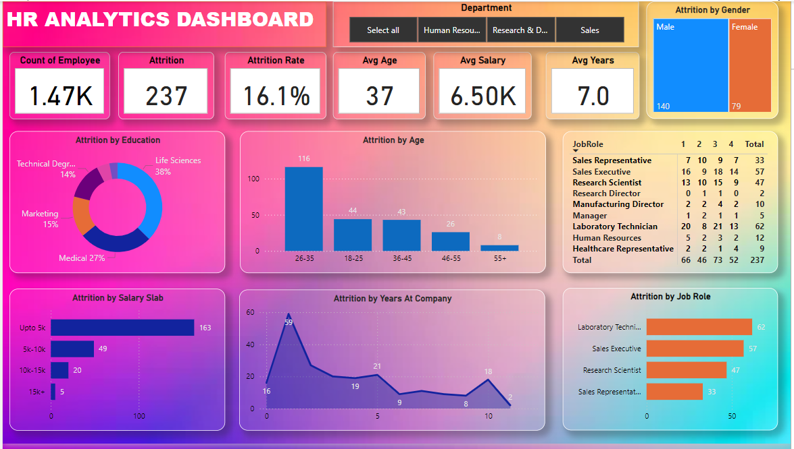

# HR-Analytics-Dashboard

1.&nbsp;DESCRIPTION

 &nbsp;This project highlights my ability to use data visualization and analytics tools to identify key insights and provide actionable recommendations.
 &nbsp;HR analytics aim to provide insight into how best to manage employees and reach business goals. The objective is to monitor key employee &nbsp;HR metrics and identify factors that impact attrition. Created several reports with information on following factors which will help the &nbsp;organization determine what action they will need to take to retain more employees. Taken some necessary steps to get insights.

2.&nbsp;Tools Used:

&nbsp;Power BI 
&nbsp;Power Query 
&nbsp;Dax Query 

3.&nbsp;Cleaning and Analyzing using Power Query:

&nbsp; Open Excel and connect to HR data 
&nbsp; Use Power Query to clean and transform the data 
&nbsp; Create a copy template for one sheet in Power Query transformations and apply the same transformations to all sheets 
&nbsp; Apply all necessary cleaning steps, such as removing duplicates, renaming columns, and changing data types 
&nbsp; Create a parameter to select the desired data based on a specific condition 
&nbsp; Encapsulate all steps into a function to be reused for future sheets and data 
&nbsp; Load and Apply the cleaned data into Power BI 

4.&nbsp;Exploring and Manipulate Some Data Using DAX Query:

&nbsp; With DAX Query, we can effectively manipulate and analyze the data to provide insights for visualization and identify areas for improvement &nbsp;&nbsp;for HR. 
&nbsp; Create Measures and columns Using DAX functions such as count, and sum functions to explore some clean data for improving dashboard KPI &nbsp;&nbsp;in PowerBI.

5.&nbsp;Power BI Dashboard Visualization:

&nbsp; Design the dashboard layout 
&nbsp; Create a measure table to aggregate and display the data using Dax functions 
&nbsp; Use Visualizations for charts and filters for the filter dashboard 
&nbsp; Now, Add Title HR Analytics Dashboard 
&nbsp; Add the Month column as Slicer and add some informative KPI. 
&nbsp; Add Bar chart, Pie chart, Column chart, Cards, Matrix chart, Donut chart, etc 

6.&nbsp;Conclusion:

 &nbsp;Analyzed employee data to identify trends and insights using Power Query and DAX in Power BI. Created an interactive dashboard to track  &nbsp;employee turnover and reasons for attrition. Discovered that salespeople are leaving the company in greater numbers due to a lower salary &nbsp;and stagnant hike rates. Provided visualizations and actionable insights to the HR team to address the issue and retain employees.

